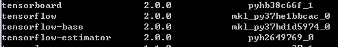

# 史上最快速安装Anaconda+TensorFlow 2.0

## Anaconda 介绍

Anaconda 是当前最流行的基于Python/R语言的数据科学处理平台，支持Linux、Windows，Mac OS X操作系统。Anaconda也成为当前开发、测试人员以及科学研究人员首选的数据科学以及机器学习的工具，其中比较显著的特性包括：

* 数量庞大的Python 库；

* 内置Conda 包管理工具；详细见https://docs.conda.io/en/latest/

* 可以使用TensorFlow来进行机器学习和深度学习开发；

  更多介绍参考官网https://www.anaconda.com/

## 安装Anaconda 

​	https://www.anaconda.com/distribution/

   

安装过程不再赘述，成功安装完成后设置环境变量。

C:\ProgramData\Anaconda3;C:\ProgramData\Anaconda3\condabin;

## 安装TensorFlow2.0

Anaconda内置了conda 包管理器，直接使用conda安装tensorflow2.0。一条命令即可，方便吧。

打开命令行cmd执行： 

​	**conda install tensorflow**

Tensorflow2.0需要使用Python3.7以上版本，所以这是为什么前文需要下载Anaconda Python3.7版本。此处install命令将默认安装tensorflow2.0，命令成功执行后，可以使用conda list来确认tensorflow是否安装成功。

C:\Users\Administrator>**conda list**

 Conda允许用户自定义虚拟运行环境，可以将它理解成虚拟机。默认安装好后会定义base运行环境。

 C:\Users\Administrator>**conda info --envs**

  \# conda environments:

  \#
  base                  *  C:\ProgramData\Anaconda3

这里不讨论如何创建新的运行环境，因为base环境已经足够让我们来运行tensorflow2.0了。

到这里一切准备工具就绪，够快不。

## 运行Tensorflow 2.0

使用conda激活base运行环境；

C:\Users\Administrator>**conda activate base**

进入Python

(base) C:\Users\Administrator>**python**
Python 3.7.4 (default, Aug  9 2019, 18:34:13) [MSC v.1915 64 bit (AMD64)] :: Ana
conda, Inc. on win32
Type "help", "copyright", "credits" or "license" for more information.
>>> **import tensorflow as tf**
>>> **print(tf.__version__)**
>>> **2.0.0**

## 结尾
到此为止，我们已成功调用tensorflow的API打印出了version2.0.0.代码虽然简单，但已足够验证TensorFlow2.0安装成功了。
Anaconda提供了Jupyter notebook工具来进行tensorflow开发，这也是目前最流行的tensorflow开发工具。后续有时间再跟大家分享一下。