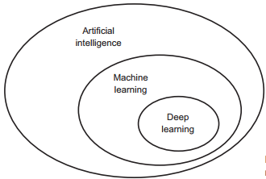
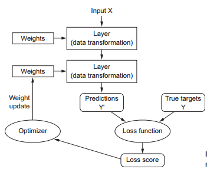

# Deep Learning With Python 学习心得

这两年充斥着人工智能AI、机器学习Machine Learning、深度学习Deep Learning等等各种专业术语，Tensorflow、Pytorch、Keras等等开发平台，真是让人眼花缭乱。

这些天宅在家阅读了Deep Learning with Python前三章 （强烈推荐阅读英文原版），书写的是真好。正如作者在**1.3.5 The democratization of deep learning** 中所提：

> One of the key factors driving this inflow of new faces in deep learning has been the
> democratization of the toolsets used in the field. In the early days, doing deep learning
> required significant C++ and CUDA expertise, which few people possessed. Nowadays,
> **basic Python scripting skills suffice to do advanced deep-learning research.   **

入门深度学习的门槛已大大降低，只要会python就能够着。而Python是一门小学生都能快速学会的语言，深度学习入门难么。今天总结一些学习心得，搞研究就得抓重点，抓住重点以后再各个击破。

## 1 - 理解深度学习的地位

如图所示。机器学习Machine Learning属于人工智能的分支，而深度学习Deep Learning属于机器学习的分支。分支的意思，就是机器学习领域内，除了深度学习的手段外，还有其它方式来实现机器学习。深度学习作为机器领域的佼佼者而胜出，目前世界上所有成功的人工智能案列， 都是基于深度学习，如计算机视觉，无人驾驶等。所以**搞人工智能，就得抓住深度学习这个重点**。

关于人工智能，机器学习的发展历史，其实也有上百年了，感兴趣的朋友可以自行了解一下。

## 2 - 深度学习的准备工作

- 英语， 不建议看任何深度学习相关的翻译书籍，晦涩难懂。

- 数学， 回忆一下二次函数、指数函数、矩阵等等吧。

- Python，绝对是二十一世纪最牛语言，没有之一。还没弄过的，赶紧看看。

- TensorFlow，2.0版本已经发布了。
- GPU or CPU: Deep Learning with Python的作者Francois Chollet提供了可以用Goole 的Cloud 环境，但后续收费可能比较贵。 或者买块Nvidia的GPU， 且只买Nvidia家的。
- Workstation： 作者强烈建议用Unix而非Windows。装个Ubuntu吧。

## 3 - 记住深度学习的模型

记住这张图，反复啃。可以称它为深入学习的模型。

- Layer: 就是层的意思，有输入有输出。输入或输出可以是一维或N维。有多少个Layer就有多少层，而层数就用来描述该深度学习模型的有多深， 多Deep;

- Weights: 就是作用在输入参数X( X1 ~ Xn) 的权重，权重会影响到输出，而该输出又是下一Layer的输入。以此类推，当数据规模Input x很大时以及Layer 层数很多时，某一层的权重是可能会影响到整个模型；确定Weights值的过程，就是深度学习；

- Loss Function: 计算模型预测值和实际值的误差；中文一般称之为损失函数。很明显，损失越小，模型精确度就越高；

- Optimizer: 将Loss Fcuntion的结果反馈到模型，计算并调整Weight；

不同的深度模型，Layer、Weight、Predictions、Loss Function、Optimizer可能都不同。这都是数学领域要分析的问题，感兴趣的可以去搜索一下，Loss Function就有很多选择，厉害的应该可以实现吧。

## 4 选择合适的项目

一上来就自行建模是不可能的，前期需要依葫芦画瓢理解思路、理解设计。

建议按照Part2 Deep Learning in Practice一步一步来，先从computer vision 开始。这也是CarAudioClub中的朋友们下一步的研究计划，有机会再跟大家分享。

# 结束语

要想不被社会淘汰，深度学习是必须要掌握的技能。总的来说，门槛不高，掌握数学和一点编程基础就足够入门。当然造诣就只能看个人了。

CarAudioClub里奔四奔五的大叔们都在努力，还在等什么呢？ 投稿吧。

